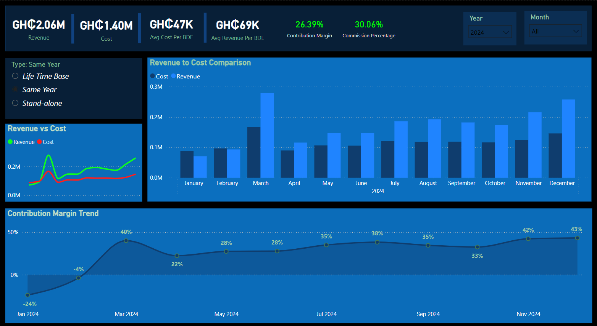
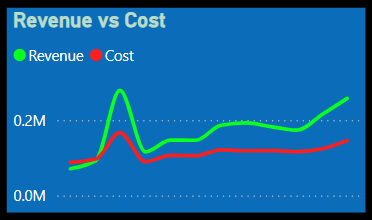
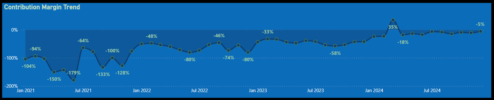

## 📊 B2B Revenue & Cost Analysis Dashboard  

### Overview  
This Power BI dashboard provides insights into revenue, cost, and contribution margin trends for the B2B department. It enables business decision-makers to analyze financial performance and optimize profitability.  

### 🔹 Key Metrics  
- **Revenue:** Total income generated from B2B sales.  
- **Cost:** Total operational costs.  
- **Average Cost Per BDE (Business Development Executive):** Cost efficiency measure per executive.  
- **Average Revenue Per BDE:** Revenue contribution per executive.  
- **Contribution Margin:** Profitability percentage after covering variable costs.  
- **Commission Percentage:** Performance-based payout ratio.  

### 📈 Features  
- **Revenue vs Cost Analysis:**  
  - Line chart comparing revenue and cost fluctuations.  
  - Insight: A sharp spike in revenue is observed at the beginning of the year, followed by stabilization.  
- **Monthly Revenue to Cost Comparison:**  
  - Bar chart visualizing revenue and cost per month.  
  - Insight: March recorded the highest revenue, significantly exceeding costs, while other months show relatively stable trends.  
- **Contribution Margin Trend:**  
  - Line graph displaying margin trends over time.  
  - Insight: The contribution margin peaked in March at **35%**, while January and May had negative margins.  
- **Custom Filters:**  
  - Year and month selectors for dynamic analysis.  
  - Option to toggle different business types (Life Time Base, Same Year, Stand-alone).  

### 🛠️ Tools & Technologies  
- **Power BI** for visualization and data analysis  
- **DAX & Power Query** for data transformation  
- **Excel** as the data backend  

### 🖼️ Screenshots  
#### Dashboard Overview  
  

#### Revenue vs Cost  
  

#### Contribution Margin Trend  
  

### 🚀 How to Use  
1. Clone this repository:  
   ```bash  
   git clone https://github.com/ManuCodeX/BDE-Sales-Profitability.git  
   ```  
2. Open the Power BI file (`.pbix`) and connect it to your data source.  
3. Customize filters and explore the visual insights.  

### 📢 Notes  
- The data used in this dashboard is **dummy data** and does not contain actual company information.  
- If you need the `.pbix` file, please contact me.  
